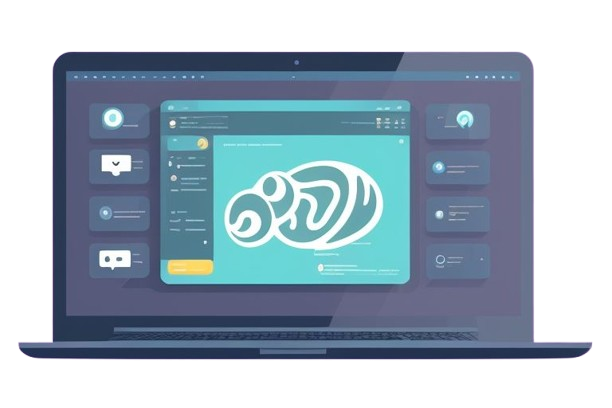

# {{cookiecutter.project_name.title()}}

## Version

Version: 0.1.0

## Developers

- Team
    - Product Owner:
        - Product Owner [[product.owner@bbva.com](mailto:product.owner@bbva.com)]
    - DAs:
        - Data Architecht 1 [[data.architecht.1@bbva.com](mailto:data.architecht.1@bbva.com)]
    - DDs:
        - Data Developer 1 [[data.developer.1@bbva.com](mailto:data.developer.1@bbva.com)]
        - Data Developer 2 [[data.developer.2@bbva.com](mailto:data.developer.2@bbva.com)]
    - DSL:
        - Data Scientist Lead [[data.scientist.lead@bbva.com](mailto:data.scientist.lead@bbva.com)]
    - DSs:
        - Data Scientist 1 [[data.scientist.1@bbva.com](mailto:data.scientist.1@bbva.com)]
        - Data Scientist 2 [[data.scientist.1@bbva.com](mailto:data.scientist.2@bbva.com)]
        - Data Scientist 3 [[data.scientist.1@bbva.com](mailto:data.scientist.3@bbva.com)]
    - MLE:
        - Machine Learning Engineer 1 [[ml.engineer.1@bbva.com](mailto:ml.engineer.1@bbva.com)]
        - Machine Learning Engineer 2 [[ml.engineer.2@bbva.com](mailto:ml.engineer.2@bbva.com)]
    - SM:
        - Scrum Master [[scrum.master@bbva.com](mailto:scrum.master@bbva.com)]

## Description

{{cookiecutter.description}}

## Features

## Issues

## Project requirements

- [ ] Tests
    - [ ] [Code coverage (-)](coverage/index.html)
    - [ ] Unit tests
    - [ ] Feature tests
    - [ ] Integration tests
    - [ ] Performance tests
- [ ] Quality Assurance
    - [ ] Code covereage
    - [ ] Code quality
    - [ ] Code style
- [ ] Profiling
    - [ ] Execution time
    - [ ] Memory usage
    - [ ] CPU usage
- [ ] CI/CD
    - [ ] Bitbucket actions
    - [ ] Jenkins
- [ ] Demo app
- [ ] Notebooks
